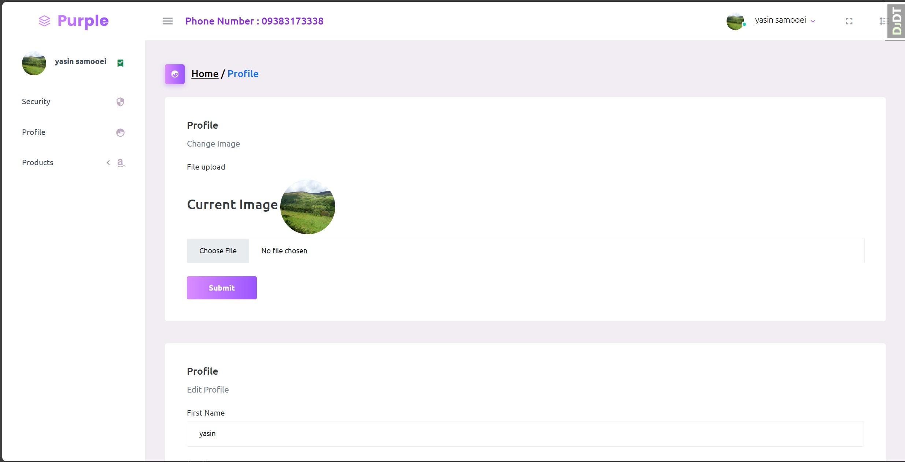

<h1 align="center">Advanced Shop</h1>
<h3 align="center">open source shop site for educational purposes</h3>
<div align="center" ><a href="https://github.com/YasinSamooei"></a></div>

### Overview
- [Features](#features)
- [Technologies](#technologies)
- [Setup](#setup)
- [Variables](#variables)
- [License](#license)

# Features
- products list
- authentication and authorization
- manage and create cart with ```sessions```
- users and admin dashboard 
- product and product hub management
- order and total price calculation
- integration with payment gateway
- order management

# dashboard overview
<div align="center" ><a href="https://github.com/YasinSamooei"></a></div>

# technologies
- django
- postgres sql
- ajax
- python-decouple

# setup
- create .env file and add variables
- ```python manage.py makemigrations```
- ``` python manage.py migrate ```
- ``` python manage.py createsuperuser ```
- ``` python manage.py runserver ```

# variables

- SECRET_KEY=django-insecure-#=-^ffw6ao=#euac(06&^1#ey-bp&imwqxl(t)+8!v(sl0dkm+
- DEBUG=True

### database
- PGDB_NAME=postgres
- PGDB_USER=postgres
- PGDB_PASSWORD=postgres
- PGDB_HOST=shop_db
- PGDB_PORT=5432

- SHOW_DEBUGGER_TOOLBAR=True

# license
- This project is open source for the practice and access of beginner Django programmers.
- The license of this project is specified under the MIT license in the <a href="https://github.com/YasinSamooei/advanced_shop/blob/main/LICENSE">license</a> file.
# programmer : <a href="https://github.com/YasinSamooei">Yasin Samooei</a>
 
